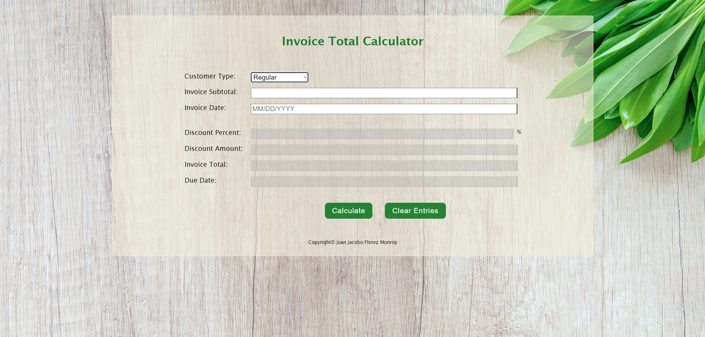

# 💵 Invoice Total Calculator

## 📌 Project Overview

The **Invoice Total Calculator** is a **web-based application** that enables users to **calculate the total invoice amount** by applying discounts based on the **customer type** and **subtotal**. Additionally, the system **calculates the due date** of the invoice by adding **30 days** to the provided invoice date.

Developed as a **college assignment**, this project showcases skills in **interactive form handling, input validation, and dynamic calculations**.

---

## 🚀 Features

- 🛒 **Customer Type Selection** – Choose from three types:
  - **Regular** → Discounts vary based on subtotal.
  - **Loyalty Program** → Fixed **30% discount**.
  - **Honored Citizen** → Discounts vary, with **higher rates** for larger subtotals.
- 🔢 **Dynamic Discount Calculation** – Automatically applies discounts based on selection.
- 💰 **Invoice Total Calculation** – Displays the **final amount** after applying the discount.
- 📆 **Due Date Calculation** – Computes **due date** by adding **30 days** to invoice date.
- 🧹 **Clear Functionality** – Resets all fields for new calculations.

---

## 🛠 Technologies Used

- **HTML5** → Structures the web interface.
- **CSS3** → Styles the layout with a **user-friendly design**.
- **JavaScript (ES6)** → Handles **input validation, calculations, and DOM manipulation**.
- **jQuery** → Simplifies event handling and updates.

---

## 🎯 Project Purpose

This project was developed as part of a **college assignment**, allowing me to practice:

- ✅ **JavaScript for dynamic form handling** and calculations.
- ✅ **Input validation** to ensure accurate data entry.
- ✅ **DOM manipulation with jQuery** for real-time UI updates.
- ✅ **Enhancing user experience** with intuitive design and feedback.
- ✅ **Responsive design principles** to ensure usability across devices.

---

## 📂 Project Structure

```
📁 invoice_calculator
 ├── 📁 images/            # Image assets (icons, backgrounds, etc.)
 ├── 📄 index.html         # Main HTML file for the form interface
 ├── 📄 invoice.css        # Stylesheet for layout and design
 ├── 📄 invoice.js         # JavaScript for validation and calculations
```

---

## 🏃‍♂️ How to Use the Application

1️⃣ **Select Customer Type** – Choose from **Regular, Loyalty Program, or Honored Citizen**.
2️⃣ **Enter Invoice Subtotal** – Input a **positive numeric value**.
3️⃣ **Provide Invoice Date** – Enter a date in `MM/DD/YYYY` format (defaults to today if left blank).
4️⃣ **Calculate Results** – Click **"Calculate"** to compute the discount, total amount, and due date.
5️⃣ **View Calculations** – Displays:
   - Discount percentage and amount.
   - Invoice **total after discount**.
   - **Due date** based on invoice date.
6️⃣ **Reset Fields** – Click **"Clear Entries"** to reset the form.

---

## 📝 Discount Details

- **Regular Customer:**
  - **Subtotal < $100** → No discount.
  - **$100 ≤ Subtotal < $250** → 10% discount.
  - **$250 ≤ Subtotal < $500** → 25% discount.
  - **Subtotal ≥ $500** → 30% discount.
- **Loyalty Program:**
  - **Always** 30% discount.
- **Honored Citizen:**
  - **Subtotal < $500** → 40% discount.
  - **Subtotal ≥ $500** → 50% discount.

---

## 📜 Code Highlights

### `calculateDiscount` Function
- Determines **discount percentage** based on **customer type** and **subtotal**.
- Applies tiered logic for **Regular** and **Honored Citizen** customers.

### `validateInvoiceDate` Function
- Ensures the date is in `MM/DD/YYYY` format.
- Checks for **valid month, day, and year** values.

### Dynamic Form Handling
- Updates **form fields dynamically** based on calculations.
- Provides **real-time validation feedback** to users.

---

## 🌟 Future Improvements

- 📄 **Export Feature** – Allow users to **save the invoice as a PDF**.
- 📆 **Graphical Date Picker** – Simplify date input with a **calendar widget**.
- 💱 **Multi-Currency Support** – Enable calculations in **different currencies**.
- 📲 **Mobile Optimization** – Improve layout for better **mobile experience**.

---

## 🎭 Screenshots  

| Invoice Total Calculator |  
|--------------|  
|  |  

---

## 📜 License

This project was developed for **educational purposes** as part of a **college assignment**.

---

## 💼 Author

👤 **Juan Jacobo Florez Monroy**  
🌐 **Portfolio**: [jjacobo95.com](https://jjacobo95.com)  
🐙 **GitHub**: [github.com/jjacoboflorez95](https://github.com/jjacoboflorez95)