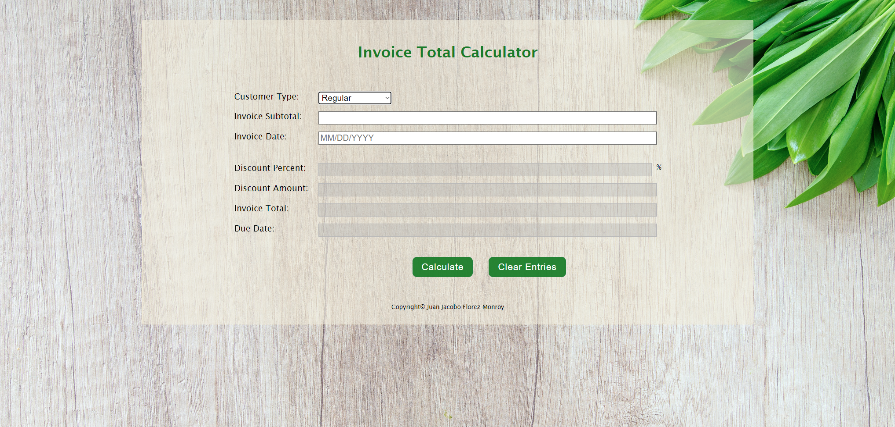

# 💵 Invoice Total Calculator

## 📌 Project Overview

The **Invoice Total Calculator** is a web-based application that enables users to calculate the total invoice amount by applying discounts based on the customer type and subtotal. The system also calculates the due date of the invoice by adding 30 days to the provided invoice date. This project showcases interactive form handling, input validation, and dynamic calculations.

## 🚀 Features

- **Customer Type Selection**: Choose from three customer types:
  - **Regular**: Discounts vary based on the subtotal.
  - **Loyalty Program**: Fixed discount of 30%.
  - **Honored Citizen**: Discounts vary, with higher rates based on the subtotal.

- **Dynamic Discount Calculation**: Automatically calculates the discount percentage and amount based on the selected customer type and subtotal.

- **Invoice Total Calculation**: Displays the final invoice amount after applying the discount.

- **Due Date Calculation**: Computes the due date by adding 30 days to the entered invoice date (defaults to the current date if none is provided).

- **Clear Functionality**: Resets all fields for new calculations.

## 📂 Project Structure

```
📁 invoice_calculator
 ├── 📁 images/            # Image assets (icons, backgrounds, etc.)
 ├── 📄 index.html         # Main HTML file for the form interface
 ├── 📄 invoice.css        # Stylesheet for layout and design
 ├── 📄 invoice.js         # JavaScript for validation and calculations
```

## 🛠 Technologies Used

- **HTML5**: Structures the web interface.
- **CSS3**: Styles the layout with a professional and user-friendly design.
- **JavaScript (ES6)**: Handles input validation, calculations, and DOM manipulation.
- **jQuery**: Simplifies event handling and dynamic updates.

## 🏃‍♂️ How to Use the Application

1. **Select Customer Type**:
   - Choose the customer type from the dropdown menu (Regular, Loyalty Program, or Honored Citizen).

2. **Enter Invoice Subtotal**:
   - Input a positive number for the subtotal amount.

3. **Provide Invoice Date**:
   - Enter the date in the format `MM/DD/YYYY`. If left blank, the system defaults to the current date.

4. **Calculate Results**:
   - Click the **"Calculate"** button to compute the discount, invoice total, and due date.

5. **View Calculations**:
   - The calculated discount percentage, discount amount, final total, and due date will be displayed.

6. **Reset Fields**:
   - Click **"Clear Entries"** to reset the form for new calculations.

## 📝 Discount Details

- **Regular Customer**:
  - **Subtotal < $100**: No discount.
  - **$100 ≤ Subtotal < $250**: 10% discount.
  - **$250 ≤ Subtotal < $500**: 25% discount.
  - **Subtotal ≥ $500**: 30% discount.

- **Loyalty Program**:
  - Always 30% discount.

- **Honored Citizen**:
  - **Subtotal < $500**: 40% discount.
  - **Subtotal ≥ $500**: 50% discount.

## 📜 Code Highlights

### `calculateDiscount` Function
- Determines the discount percentage based on the customer type and subtotal.
- Applies tiered logic for Regular and Honored Citizen customers.

### `validationInvoiceDate` Function
- Validates the invoice date format (`MM/DD/YYYY`).
- Checks for valid month, day, and year values.

### Dynamic Form Handling
- Updates the form fields dynamically based on calculations.
- Provides real-time validation feedback to users.

## 🌟 Future Improvements

- **Export Feature**: Allow users to save the calculated invoice as a PDF.
- **Graphical Date Picker**: Simplify date input with a calendar widget.
- **Multi-Currency Support**: Enable calculations in different currencies.
- **Responsive Enhancements**: Further optimize the layout for mobile devices.

## 🎭 Screenshots  

| Invoice Total Calculator |  
|--------------|  
|  |  

## 📜 License

This project was developed for educational purposes as part of a **college assignment**.

---

💼 **Author:** Juan Jacobo Florez Monroy | 🚀 **GitHub**: [GitHub](https://github.com/jjacoboflorez95)  